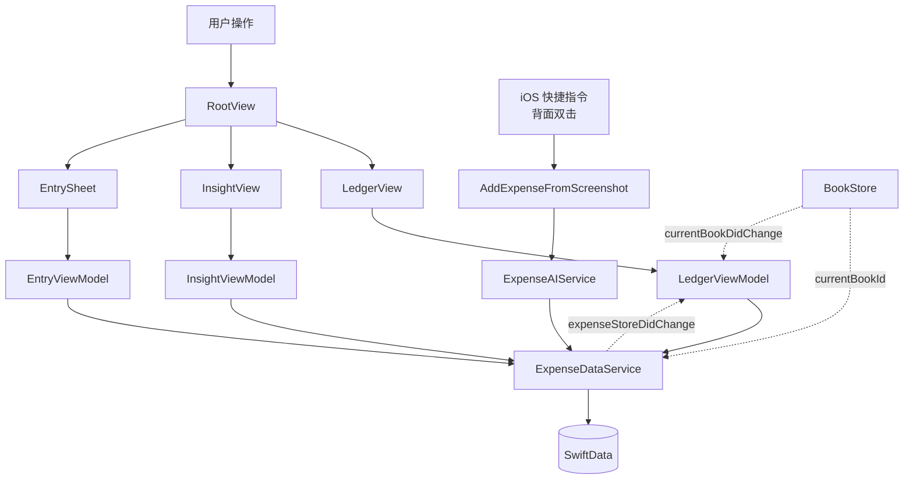

# ZenCoin

> **安静记账 · Quietly counting.**
> 一款专为 iOS 打造的禅意记账 app —— 三下记账，一眼了然。
> A zen-minimal iOS bookkeeping app — three taps to record, one glance to know.

<!-- TODO: 替换为实际链接 -->
[](https://developer.apple.com/ios/)
[](https://swift.org)
[](https://developer.apple.com/xcode/swiftui/)
[](https://developer.apple.com/xcode/swiftdata/)
[](LICENSE)
[](https://github.com/Jhang-Z/ZenCoin)

---

## 📑 目录 · Table of Contents

- [✨ 功能特性 Features](#-功能特性--features)
- [🎬 演示 Demo](#-演示--demo)
- [🚀 快速开始 Quick Start](#-快速开始--quick-start)
- [📖 使用教程 Usage](#-使用教程--usage)
- [🏗️ 技术栈 Tech Stack](#️-技术栈--tech-stack)
- [🧠 核心原理 How It Works](#-核心原理--how-it-works)
- [📁 项目结构 Project Structure](#-项目结构--project-structure)
- [🛠️ 配置 Configuration](#️-配置--configuration)
- [🗺️ 路线图 Roadmap](#️-路线图--roadmap)
- [🤝 贡献指南 Contributing](#-贡献指南--contributing)
- [📄 License](#-license)
- [🙏 致谢 Acknowledgments](#-致谢--acknowledgments)

---

## ✨ 功能特性 · Features

- 📓 **多账本 Multi-book** — 主账本 + 自定义场景账本（旅行 / 装修 / …），切换 1-tap，独立汇总
  *Default book + scenario books (Travel / Renovation / …); switch in one tap, isolated stats.*
- 🤖 **AI 截图记账 AI shortcut entry** — 通过 iOS Shortcuts + 阿里云百炼 `qwen-vl-max-latest` 识别支付截图，背面双击 → 后台静默写入
  *AppIntent + Bailian Vision parses payment screenshots. Bind to Back-Tap, runs silently in background.*
- 🍩 **统计圆盘 Donut insight** — 自绘环形分类图 + 外置标签 + 引线，旁边附月度/年度日历热图
  *Custom donut chart with side-stacked labels & leader lines; paired with month/year heatmap calendar.*
- 🎨 **四套主题 Four themes** — Claude（羊皮纸 · serif）/ Cursor（暖奶油）/ Zapier（米白）/ ElevenLabs（深色薄荷），每套 token 独立
  *Theme presets inspired by Anthropic / Cursor / Zapier / ElevenLabs design systems.*
- 🧮 **简单计算键盘 Calculator keypad** — 自绘金额键盘支持 `+ − × ÷` 表达式，求值预览实时显示
  *Custom amount pad with simple expression evaluation (+ − × ÷), live preview of evaluated total.*
- 🌐 **中英共谋 Bilingual UI** — 结构标签英文大写（IN / OUT / BAL / LEDGER），动作与内容中文
  *English caps for structural labels, Chinese for actions and content.*
- 🧘 **零彩虹 / 零阴影 / 零通知** — 严格遵守自有 [`DESIGN.md`](DESIGN.md) 设计语言
  *No rainbow gradients, no shadows, no nagging notifications. Strict adherence to in-house design system.*

---

## 🎬 演示 · Demo

<!-- TODO: 在此填写截图 / GIF / TestFlight 链接 -->

| Ledger | Insight | Theme |
|---|---|---|
| _截图占位_ | _截图占位_ | _截图占位_ |

---

## 🚀 快速开始 · Quick Start

### 环境要求 · Prerequisites

- macOS 14+
- Xcode 15+
- iOS 17+ Simulator 或真机
- [`xcodegen`](https://github.com/yonaskolb/XcodeGen)（生成 `.xcodeproj`）
- [`gh`](https://cli.github.com/)（可选，PR 流程用）

```bash
brew install xcodegen
```

### 安装与运行 · Install & Run

```bash
# 1. Clone
git clone https://github.com/Jhang-Z/ZenCoin.git
cd ZenCoin

# 2. 生成 Xcode 项目（每次修改 project.yml 后都要重新生成）
xcodegen

# 3. 用 Xcode 打开
open ZenCoin.xcodeproj

# 4. 或者命令行构建到模拟器
xcodebuild -project ZenCoin.xcodeproj \
  -scheme ZenCoin \
  -destination 'platform=iOS Simulator,name=iPhone 17 Pro' \
  build
```

### AI 功能配置 · Enable AI

1. 在阿里云百炼控制台申请 API Key（`sk-...`）
2. 打开 app → 设置 → AI 智能记账 → 粘贴 Key 保存
3. 在 iOS「快捷指令」中新建一个：「截取屏幕」→「AI 截图记账」（来自 ZenCoin）
4. 设置 → 辅助功能 → 触控 → 轻点背面 → 双击 → 选这个快捷指令

完成后双击手机背面即可一键 AI 记账，全程 app 不进前台。

---

## 📖 使用教程 · Usage

### 手动记账 · Manual entry

```text
点底部浮动「+」 → 选支出 / 收入 → 输入金额（支持 100+50+30 表达式）
                  → 选分类（12 类支出 + 4 类收入）→ 添加描述（可选）→ 保存
```

### AI 截图记账 · AI shortcut entry

```text
看到支付凭证 → 双击手机背面 → 系统快捷指令运行
            → 截屏 → ZenCoin AppIntent 后台调 AI
            → 自动写入当前账本 → 横幅提示 "记账成功 · 餐饮 -¥38"
```

### 多账本切换 · Switch books

```text
头部 chip（账本名 + ▼）→ tap → 弹切换 sheet → 选目标账本
管理（新建 / 重命名 / 删除）→ 设置 → BOOKS → 管理账本
```

### 月份导航 · Month navigation

```text
点月份标签 → MonthPickerSheet（年份步进 + 4×3 月份格）
头部水平滑动 ≥60pt → 上 / 下个月
```

---

## 🏗️ 技术栈 · Tech Stack

| 类别 Category | 技术 Tech | 用途 Purpose |
|---|---|---|
| 语言 Language | Swift 5.9 | 全部业务代码 |
| UI Framework | SwiftUI | 全部界面 |
| 数据持久化 Persistence | SwiftData (`@Model`) | Expense / Book 模型 |
| 状态管理 State | `@Observable` macro | ViewModels / Stores |
| 项目生成 Project gen | XcodeGen | 由 `project.yml` 生成 `.xcodeproj` |
| AI Backend | 阿里云百炼 `qwen-vl-max-latest` | 支付截图视觉理解 |
| 系统集成 System | App Intents · iOS Shortcuts · Back Tap | 后台静默 AI 记账 |
| Keychain | `Security.framework` | 存储 API Key |
| 字体 Typography | SF Pro · New York (`Font.Design.serif`) | 跟随主题切换 |

---

## 🧠 核心原理 · How It Works

ZenCoin 由几个核心子系统组成，彼此通过 `NotificationCenter` + `@Observable` 解耦：



**关键设计 · Key designs:**

1. **Theme tokens 全局注入** — `ThemeManager`（`@Observable`）通过 `Environment` 把 `ThemeTokens` 推到所有子视图。换主题 = 换 token，结构不变。
2. **Book 作用域过滤** — `Expense.bookId` 是每条记录的归属。所有 fetch 都带 `#Predicate { $0.bookId == bookId }`，AppIntent 通过 `UserDefaults` 共享 `currentBookId`，保证后台记账落到正确账本。
3. **AppIntent + Shortcuts** — `openAppWhenRun: false` 让 AI 记账完全在后台扩展进程中跑，独立打开 SwiftData 容器写入，并通过 `NotificationCenter` 通知前台 app 刷新。
4. **自绘 donut + 引线分布算法** — 切片按半圆分组 → 各侧按 Y 排序 → 双向 sweep 强制最小垂直间隔 → L 形引线连接。最多 6 段（top-5 + 「其他」聚合）的场景收敛干净。

---

## 📁 项目结构 · Project Structure

```
ZenCoin/
├── DESIGN.md                       # 自有设计语言（哲学 / 色彩 / 字号 / 反模式）
├── project.yml                     # XcodeGen 配置
├── ZenCoin/
│   ├── ZenCoinApp.swift            # @main + ModelContainer
│   ├── Core/
│   │   ├── Notifications/          # NotificationCenter 名字
│   │   ├── Storage/                # KeychainService
│   │   ├── Theme/                  # ThemeID / Tokens / Presets / Typography
│   │   └── UI/                     # ZenConfirmDialog（替代系统弹窗）
│   ├── Features/
│   │   ├── AI/
│   │   │   ├── Intent/             # AddExpenseFromScreenshot · ExpenseShortcuts
│   │   │   └── Services/           # BailianKeyService · ExpenseAIService · ShortcutInstallerService
│   │   ├── Books/
│   │   │   ├── Models/             # Book @Model
│   │   │   ├── Stores/             # BookStore (@Observable)
│   │   │   └── Views/              # BookChip · BookSwitchSheet · BookManagementView
│   │   ├── Insight/
│   │   │   ├── ViewModels/         # InsightViewModel
│   │   │   └── Views/              # InsightView · DonutChartView · CalendarHeatmapView · YearPickerSheet
│   │   ├── Ledger/
│   │   │   ├── Models/             # Expense @Model · ExpenseCategory
│   │   │   ├── Services/           # ExpenseDataService
│   │   │   ├── ViewModels/         # LedgerViewModel · EntryViewModel
│   │   │   └── Views/              # RootView · LedgerView · EntrySheet · ExpenseDetailView · …
│   │   └── Settings/
│   │       └── Views/              # SettingsView · ThemePickerView
│   └── Resources/Info.plist
└── docs/                           # 设计 spec / 实现 plan
```

---

## 🛠️ 配置 · Configuration

### URL Scheme

`Info.plist` 已注册 `zencoin://` 用于快捷指令调用兜底（主路径是 AppIntent）。

### iCloud 快捷指令一键导入 · One-tap shortcut install

把你 export 出去得到的 iCloud 链接粘到 [`ShortcutInstallerService.swift`](ZenCoin/Features/AI/Services/ShortcutInstallerService.swift):

```swift
static let iCloudLink: String = "https://www.icloud.com/shortcuts/xxxxxxxxxx"
```

设置 → AI 智能记账 → 安装快捷指令 即可一键导入；为空时 fallback 直接打开「快捷指令」app。

### 主题切换 · Theme switching

设置 → 外观 → 主题 → 选 Claude / Cursor / Zapier / ElevenLabs。
当前选择持久化在 `UserDefaults`。

---

## 🗺️ 路线图 · Roadmap

- [x] 多账本 Multi-book
- [x] AI 截图记账 AI shortcut entry
- [x] 月度 / 年度 donut + 日历热图
- [x] 4 套主题（含暗色 ElevenLabs）
- [ ] iCloud 同步 CloudKit sync <!-- TODO: 评估 -->
- [ ] 预算 Budget alerts
- [ ] 数据导出（CSV / JSON）Data export
- [ ] Apple Watch widget
- [ ] 多语言（en-US）i18n

---

## 🤝 贡献指南 · Contributing

欢迎 issue / PR。流程：

```bash
# 1. Fork
# 2. 新建分支
git checkout -b feat/your-feature

# 3. 修改后跑一遍构建
xcodegen
xcodebuild -project ZenCoin.xcodeproj -scheme ZenCoin \
  -destination 'platform=iOS Simulator,name=iPhone 17 Pro' build

# 4. 提交
git commit -m "feat: your feature"
git push origin feat/your-feature

# 5. 在 GitHub 上发 Pull Request
```

**代码风格 · Code style:**
- 遵循 [`DESIGN.md`](DESIGN.md) 的设计语言（克制优先 / 一屏一主角 / 中英共谋）
- 颜色不要 hardcode，统一走 `theme.xxx` token
- 间距遵守 24 / 16 / 12-14 grid
- 不要为账单行加常驻 trash 图标（参见反模式列表）

**Issue 模板 · Issue templates:**

提交 issue 请说明：
- 复现路径
- 当前主题（影响视觉问题判断）
- 模拟器 vs 真机
- iOS 版本

---

## 📄 License

[MIT](LICENSE) © [Jhang-Z](https://github.com/Jhang-Z)

<!-- TODO: 如需要更换 License，请同步修改 LICENSE 文件 -->

---

## 🙏 致谢 · Acknowledgments

- [VoltAgent / awesome-design-md](https://github.com/VoltAgent/awesome-design-md) — Claude / Cursor / Zapier / ElevenLabs 设计系统的灵感来源
- [FlashNotes](https://github.com/Jhang-Z/FlashNotes) — ZenCoin 是从这个项目的 Expense 子系统抽离重构而来；AI Prompt 与 App Intent 模式直接搬过来
- [阿里云百炼 Qwen-VL](https://help.aliyun.com/zh/dashscope/) — 视觉理解能力
- [XcodeGen](https://github.com/yonaskolb/XcodeGen) — 把 Xcode 项目从二进制黑盒解放出来
- Apple — SwiftUI / SwiftData / App Intents

---

> Made with quiet attention by [@Jhang-Z](https://github.com/Jhang-Z).
